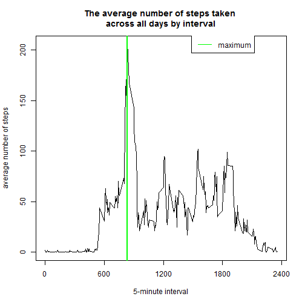
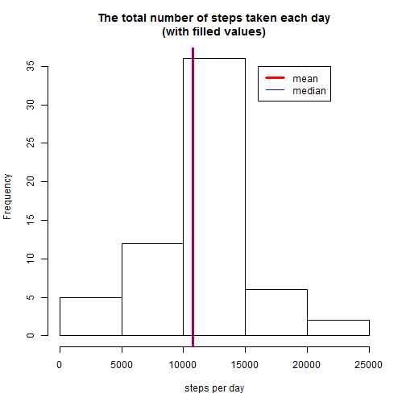
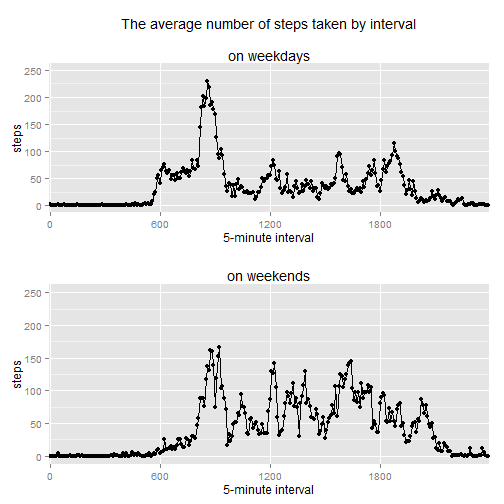

# Loading and preprocessing the data

### Load packages
For the analysis we'll need several packages that will help us to work with dates, plots and also to transform data sets. These are lubridate, ggplot2, grid, gridExtra, dplyr, Scale, knitr.

### Load data sets
After we are sure that folder with data is in the working directory we can load the data for the analysis.


```r
setwd("repdata-data-activity")
activity <-read.csv("activity.csv")
```

### View the structure of the data set
Before making the analysis itself we'd like to have a look at the data format and deside whether it needs any preprocessing.


```r
str(activity)
```

```
## 'data.frame':	17568 obs. of  3 variables:
##  $ steps   : int  NA NA NA NA NA NA NA NA NA NA ...
##  $ date    : Factor w/ 61 levels "2012-10-01","2012-10-02",..: 1 1 1 1 1 1 1 1 1 1 ...
##  $ interval: int  0 5 10 15 20 25 30 35 40 45 ...
```

### Sort the variables in the proper order and convert to appropriate value format
It seems that the order of the variables isn't really convenient, thus we'll have to sort them properly. The date variable is a factor, however we won't convert it to the date format for now, since not all the operations in our research can be used with it. The interval variable should be converted to the factor format. Since we'll calculate various ratios for steps variable, it should be made numeric.


```r
sorted_act <- data.frame("date" = activity$date, "interval" = as.factor(activity$interval), "steps" = as.numeric(activity$steps))
str(sorted_act)
```

```
## 'data.frame':	17568 obs. of  3 variables:
##  $ date    : Factor w/ 61 levels "2012-10-01","2012-10-02",..: 1 1 1 1 1 1 1 1 1 1 ...
##  $ interval: Factor w/ 288 levels "0","5","10","15",..: 1 2 3 4 5 6 7 8 9 10 ...
##  $ steps   : num  NA NA NA NA NA NA NA NA NA NA ...
```
  
# What is mean total number of steps taken per day?

### Remove NAs
Firstly, we need to remove all the missing values in the data set, so as we could analise it properly.


```r
sorted_act_completes <- sorted_act[which(complete.cases(sorted_act$steps)), ]
head(sorted_act_completes)
```

```
##           date interval steps
## 289 2012-10-02        0     0
## 290 2012-10-02        5     0
## 291 2012-10-02       10     0
## 292 2012-10-02       15     0
## 293 2012-10-02       20     0
## 294 2012-10-02       25     0
```

### Calculate the total number of steps taken per day
Now we are going to make a new table with sums of steps taken per day.


```r
steps_per_day_completes <- sorted_act[1, c(1, 3)]
for (day in levels(sorted_act_completes$date)) {
        day_steps <- sorted_act_completes[which(sorted_act_completes$date == day), ]
        steps <- sum(day_steps$steps)
        steps_per_day_completes <- rbind(steps_per_day_completes, c(day, steps))
}
steps_per_day_completes <- steps_per_day_completes[-1, ]
steps_per_day_completes$steps <- as.numeric(steps_per_day_completes$steps)
head(steps_per_day_completes)
```

```
##         date steps
## 2 2012-10-01     0
## 3 2012-10-02   126
## 4 2012-10-03 11352
## 5 2012-10-04 12116
## 6 2012-10-05 13294
## 7 2012-10-06 15420
```

### Calculate the mean and median of the total number of steps taken per day
Having the numbers of steps taken per day we are able to get the mean and median.


```r
mean_steps_per_day <- mean(steps_per_day_completes$steps)
median_steps_per_day <- median(steps_per_day_completes$steps)
mean_steps_per_day
```

```
## [1] 9354.23
```

```r
median_steps_per_day
```

```
## [1] 10395
```
Thus, mean of the steps taken per day was 9354.23 and median was 10395.

### Draw a histogram of the total number of steps taken each day
After we got complete dataset, we are able to create a histogram of the data that shows the distribution of steps taken per day.


```r
hist(steps_per_day_completes$steps, main = "The total number of steps taken each day",
     xlab = "steps per day")
abline(v = mean_steps_per_day, col="red", lwd = 3)
abline(v = median_steps_per_day, col="blue", lwd = 3)
legend(16000, 29, c("mean", "median"), col = c("red", "blue"), lty = c(1, 1), lwd = c(3, 3))
```

 
  
Overall, the distribution doesn't appear to be normal. It's quite skewed to the right. It's also proved by the negative difference of the mean and the median of the distribution.

### Save the graph as PNG file
Finaly, we save the results as PNG file.


```r
dev.copy(png, file = "The total number of steps taken each day.Png")
dev.off() 
```
  
# What is the average daily activity pattern?

### Calculate average numbers of steps taken by 5-minute intervals
One more operation with the dataset will be getting means for each interval across all the days.


```r
avg_steps_by_interval <- sorted_act[1, c(2, 3)]
for (interval in levels(sorted_act_completes$interval)) {
        interval_steps <- sorted_act_completes[which(sorted_act_completes$interval == interval), ]
        avg_steps <- mean(interval_steps$steps)
        avg_steps_by_interval <- rbind(avg_steps_by_interval, c(interval, avg_steps))
}
avg_steps_by_interval <- avg_steps_by_interval[-1, ]
avg_steps_by_interval$steps <- round(as.numeric(avg_steps_by_interval$steps))
head(avg_steps_by_interval)
```

```
##   interval steps
## 2        0     2
## 3        5     0
## 4       10     0
## 5       15     0
## 6       20     0
## 7       25     2
```

### Calculate the interval with the maximum number of steps on average
Now it's easy to get the 5-minute interval during which the maximum number of steps were taken.


```r
max_steps_taken <- max(avg_steps_by_interval$steps)
max_steps_interval <- as.character(avg_steps_by_interval[
        which(avg_steps_by_interval$steps == max_steps_taken), 1])
max_steps_taken
```

```
## [1] 206
```

```r
max_steps_interval
```

```
## [1] "835"
```
Consequently, the maximum of 206 steps were taken during the 835-th 5-minute interval or at 8:35-40 o'clock, more likely when going to the job in the morning.

### Build a plot of the average numbers of steps taken by 5-minute intervals
We are able now to draw a graph of the average number of steps taken during various 5-minute intervals through the day.


```r
plot(as.character(avg_steps_by_interval$interval), avg_steps_by_interval$steps, 
     type = "l", main = "The average number of steps taken \nacross all days by interval",
     xlab = "5-minute interval", ylab = "average number of steps", xaxt = "n")
axis(1, at = c(0, 600, 1200, 1800, 2400))
abline(v = max_steps_interval, col = "green", lwd = 2)
legend(1487, 214.5, "maximum", col = "green", lty = 1)
```

 
  
### Save the graph as PNG file
Again we save the results as PNG file.


```r
dev.copy(png, file = "The average number of steps taken across all days by interval.Png")
dev.off() 
```
  
# Imputing missing values

### Calculate and report the total number of missing values in the dataset
Now it will be useful to define the number of missing values in the dataset.


```r
sum(is.na(sorted_act))
```

```
## [1] 2304
```
So we have 2304 NAs.

### Copy the main data set and fill in all the missing values
For more accurate research we need to fill in the missing values with some plausible numbers. We'll use interval averages calculated on the previous step of research.


```r
filled_act <- sorted_act
for (obs in 1:length(filled_act$steps)) {
        if (is.na(filled_act$steps[obs]) == TRUE) {
                filled_act$steps[obs] = round(avg_steps_by_interval$steps[which(avg_steps_by_interval$interval == filled_act$interval[obs])])
        }
}
str(filled_act)
```

```
## 'data.frame':	17568 obs. of  3 variables:
##  $ date    : Factor w/ 61 levels "2012-10-01","2012-10-02",..: 1 1 1 1 1 1 1 1 1 1 ...
##  $ interval: Factor w/ 288 levels "0","5","10","15",..: 1 2 3 4 5 6 7 8 9 10 ...
##  $ steps   : num  2 0 0 0 0 2 1 1 0 1 ...
```

```r
sum(is.na(filled_act))
```

```
## [1] 0
```
Thus, we filled the NAs and can continue the research.

### Calculate the total number of steps taken per day (using filled values)
Now we are going to make a new table with sums of steps taken per day.


```r
steps_per_day_filled <- filled_act[1, c(1, 3)]
for (day in levels(filled_act$date)) {
        day_steps <- filled_act[which(filled_act$date == day), ]
        steps <- sum(day_steps$steps)
        steps_per_day_filled <- rbind(steps_per_day_filled, c(day, steps))
}
steps_per_day_filled <- steps_per_day_filled[-1, ]
steps_per_day_filled$steps <- as.numeric(steps_per_day_filled$steps)
head(steps_per_day_filled)
```

```
##         date steps
## 2 2012-10-01 10762
## 3 2012-10-02   126
## 4 2012-10-03 11352
## 5 2012-10-04 12116
## 6 2012-10-05 13294
## 7 2012-10-06 15420
```

### Calculate new mean and median of the total number of steps taken per day
Having the numbers of steps taken per day we are able to get the mean and median.


```r
new_mean_steps_per_day <- mean(steps_per_day_filled$steps)
new_median_steps_per_day <- median(steps_per_day_filled$steps)
new_mean_steps_per_day
```

```
## [1] 10765.64
```

```r
new_median_steps_per_day
```

```
## [1] 10762
```
Thus, mean of the steps taken per day was 10765.64 and median was 10762.

### Draw a new histogram of the total number of steps taken each day
After we got complete dataset, we are able to create a histogram of the data that shows the distribution of steps taken per day.


```r
hist(steps_per_day_filled$steps, main = "The total number of steps taken each day\n(with filled values)",
     xlab = "steps per day")
abline(v = new_mean_steps_per_day, col="red", lwd = 3)
abline(v = new_median_steps_per_day, col="blue", lwd = 1)
legend(16000, 35, c("mean", "median"), col = c("red", "blue"), lty = c(1, 1), lwd = c(3, 1))
```

 
  
The histogram of steps per day with filled values looks much more interesting than the one with droped missing values. It definitely reminds the normal distribution and at least is quite simmetric, as the mean almost equals the median of the distribution. As we saw, the filled values for a day was a number near the mean of the distribution. Consequently, such a filling made the distribution streched up in the center and decreased on the sides.

### Save the graph as PNG file
And we're going to save the results as PNG file once more.

```r
dev.copy(png, file = "The total number of steps taken each day (with filled values).Png")
dev.off()
```
  
# Are there differences in activity patterns between weekdays and weekends?

### Change system names for days week to English
In order to make the research more clear for assasment peers we'll change system names for week days to English.


```r
Sys.setlocale("LC_TIME", "English")
```

```
## [1] "English_United States.1252"
```

### Create a weekday/weekend factor variable
Now we'll convert date variable into the date format. Then we'll add a factor variable which defines the day of week of the day (e. g. Monday, Tuesday etc.) and a factor variable with two levels that shows whether a day is a weekday or a weekend.


```r
filled_act$date <- as.Date(filled_act$date)
filled_act <- mutate(filled_act, "day_of_week" = as.factor(weekdays(filled_act$date, abbreviate = TRUE)),
                     "week_day" = factor("weekday", levels = c("weekday", "weekend")))
for (day in 1:length(filled_act$day_of_week)) {
        if (filled_act$day_of_week[day] == "Sat" | filled_act$day_of_week[day] == "Sun") {
                filled_act$week_day[day] = as.factor("weekend")
        } 
}
str(filled_act)
```

```
## 'data.frame':	17568 obs. of  5 variables:
##  $ date       : Date, format: "2012-10-01" "2012-10-01" ...
##  $ interval   : Factor w/ 288 levels "0","5","10","15",..: 1 2 3 4 5 6 7 8 9 10 ...
##  $ steps      : num  2 0 0 0 0 2 1 1 0 1 ...
##  $ day_of_week: Factor w/ 7 levels "Fri","Mon","Sat",..: 2 2 2 2 2 2 2 2 2 2 ...
##  $ week_day   : Factor w/ 2 levels "weekday","weekend": 1 1 1 1 1 1 1 1 1 1 ...
```

```r
head(filled_act)
```

```
##         date interval steps day_of_week week_day
## 1 2012-10-01        0     2         Mon  weekday
## 2 2012-10-01        5     0         Mon  weekday
## 3 2012-10-01       10     0         Mon  weekday
## 4 2012-10-01       15     0         Mon  weekday
## 5 2012-10-01       20     0         Mon  weekday
## 6 2012-10-01       25     2         Mon  weekday
```

### Calculate average numbers of steps taken by 5-minute intervals on weekdays and weekends respectively
Next operation will be getting means for each interval across all the weekdays and all the weekends respectively. The nested for loops will help.


```r
avg_steps_by_interval_new <- filled_act[1, c(2, 3, 5)]
for (day in levels(filled_act$week_day)) {
        day_filled_act <- filled_act[which(filled_act$week_day == day), ]
        for (interval in levels(filled_act$interval)) {
                interval_steps <- day_filled_act[which(filled_act$interval == interval), ]
                avg_steps <- mean(interval_steps$steps, na.rm = TRUE)
                avg_steps_by_interval_new <- rbind(avg_steps_by_interval_new, c(interval, avg_steps, day))
        }
}
avg_steps_by_interval_new <- avg_steps_by_interval_new[-1, ]
avg_steps_by_interval_new$steps <- round(as.numeric(avg_steps_by_interval_new$steps))
head(avg_steps_by_interval_new)
```

```
##   interval steps week_day
## 2        0     2  weekday
## 3        5     0  weekday
## 4       10     0  weekday
## 5       15     0  weekday
## 6       20     0  weekday
## 7       25     2  weekday
```

```r
tail(avg_steps_by_interval_new)
```

```
##     interval steps week_day
## 572     2330     1  weekend
## 573     2335    12  weekend
## 574     2340     6  weekend
## 575     2345     2  weekend
## 576     2350     0  weekend
## 577     2355     0  weekend
```

### Separate table by day of week factor
To make the plotting easier we'll separate the table by the weekday/end factor.


```r
weekday_avg_steps_by_interval <- avg_steps_by_interval_new[which(avg_steps_by_interval_new$week_day == "weekday"), ]
weekend_avg_steps_by_interval <- avg_steps_by_interval_new[which(avg_steps_by_interval_new$week_day == "weekend"), ]
head(weekday_avg_steps_by_interval)
```

```
##   interval steps week_day
## 2        0     2  weekday
## 3        5     0  weekday
## 4       10     0  weekday
## 5       15     0  weekday
## 6       20     0  weekday
## 7       25     2  weekday
```

```r
head(weekend_avg_steps_by_interval)
```

```
##     interval steps week_day
## 290        0     0  weekend
## 291        5     0  weekend
## 292       10     0  weekend
## 293       15     0  weekend
## 294       20     0  weekend
## 295       25     4  weekend
```

### Build a plot of the average numbers of steps taken by 5-minute intervals
Finaly, we'll draw plots of weekday and weekend average numbers of steps taken by 5-minute intervals.


```r
weekday_steps <- ggplot(data = weekday_avg_steps_by_interval, aes(x = interval, y = steps, group = 1)) +
        geom_line() + geom_point() +
        ggtitle("The average number of steps taken by interval\n\non weekdays") +
        xlab("5-minute interval") + ylab("steps") + ylim(c(0, 250)) +
        scale_x_discrete(breaks = seq(0, 2400, 600))
weekend_steps <- ggplot(data = weekend_avg_steps_by_interval, aes(x = interval, y = steps, group = 1)) +
        geom_line() + geom_point() +
        ggtitle("on weekends") +
        xlab("5-minute interval") + ylab("steps") + ylim(c(0, 250)) +
        scale_x_discrete(breaks = seq(0, 2400, 600))
grid.arrange(arrangeGrob(weekday_steps, weekend_steps, ncol=1, nrow = 2))
```

 
  
Comparing the plots we can say that on weekdays people walk a lot in the morning (around 225 steps at near 9 o'clock), probably when hurring to their jobs, while during the rest of the day they are less active (no more then 100 steps in a 5-minute interval). On the contrary, on weekends people walk less actively in the morning (no more than 175 steps in a 5-minute interval), but they walk more during the whole day (the variability of steps taken from 10 to 21 o'clock is greater on weekends than on weekdays).

### save the graph as PNG file
Last but not least, we're going to save these plots too.


```r
dev.copy(png, file = "The average number of steps taken by interval on weekdays and weekends.Png")
dev.off()
```
